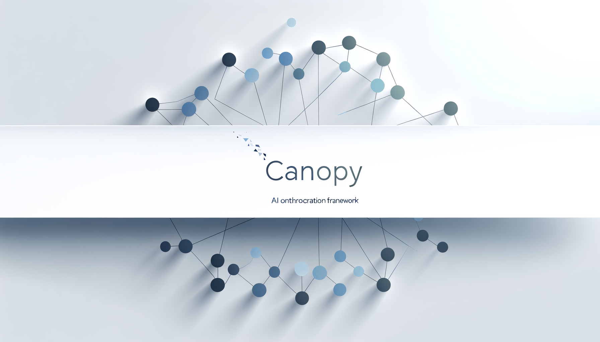

# 🌳 Canopy: Multi-Agent Consensus through Tree-Based Exploration

[](https://www.python.org/downloads/)
[](LICENSE)

> **⚠️ Work in Progress**: Canopy is actively under development. While core functionality is operational, some features may be incomplete or subject to change. We welcome and invite contributions from the community to help shape the future of this project!



> A multi-agent system for collaborative AI problem-solving through parallel exploration and consensus building.

## Overview

Canopy extends the foundational work of [MassGen](https://github.com/ag2ai/MassGen) by the AG2 team, enhancing it with tree-based exploration algorithms, comprehensive testing, and modern developer tooling. The system orchestrates multiple AI agents working in parallel, observing each other's progress, and refining their approaches to converge on optimal solutions.

This project builds upon the "threads of thought" and "iterative refinement" concepts from [The Myth of Reasoning](https://docs.ag2.ai/latest/docs/blog/#the-myth-of-reasoning) and extends the multi-agent conversation patterns pioneered in [AG2](https://github.com/ag2ai/ag2).

## Key Features

- **Multi-Agent Orchestration**: Coordinate multiple AI models working on the same problem
- **Tree-Based Exploration**: MCTS-inspired algorithms for systematic solution space exploration  
- **Consensus Building**: Agents vote and debate to reach agreement on solutions
- **Real-Time Visualization**: Terminal UI built with Textual for monitoring agent progress
- **OpenAI API Compatibility**: Drop-in replacement for OpenAI API with multi-agent capabilities
- **Comprehensive Testing**: Full test coverage with pytest
- **Modern Python Tooling**: Type hints, linting with black/isort/flake8/mypy

## What's New in Canopy

Building on MassGen's foundation, Canopy adds:

### Algorithm Enhancements
- Tree-based exploration algorithms (TreeQuest) for systematic solution search
- Configurable algorithm profiles for different problem types
- Enhanced consensus mechanisms with weighted voting

### Developer Experience
- Interactive terminal UI using Textual with multiple themes
- OpenAI-compatible API server for integration with existing tools
- MCP (Model Context Protocol) server for tool integration
- AG2-compatible agent interface
- Comprehensive test suite with >90% coverage
- Automated code formatting and linting

### API and Integration
- RESTful API with OpenAI-compatible endpoints
- Streaming support for real-time responses
- Dynamic agent configuration per request
- Full request/response compatibility with OpenAI clients

### Quality of Life
- Structured logging with session management
- Configuration validation and error handling
- Docker support for containerized deployment
- GitHub Actions CI/CD pipeline

## Installation

```bash
# Clone the repository
git clone https://github.com/yourusername/canopy.git
cd canopy

# Install with pip
pip install -e .

# Or with uv (recommended)
uv pip install -e .
```

## Configuration

Create a `.env` file with your API keys:

```bash
# OpenRouter (recommended for multi-model access)
OPENROUTER_API_KEY=your_key_here

# Individual providers (optional)
OPENAI_API_KEY=your_key_here
ANTHROPIC_API_KEY=your_key_here
GEMINI_API_KEY=your_key_here
XAI_API_KEY=your_key_here
```

## Usage

### Command Line Interface

```bash
# Multi-agent mode with specific models
python cli.py "Explain quantum computing" --models gpt-4 claude-3 gemini-pro

# Use configuration file
python cli.py --config examples/fast_config.yaml "Your question here"

# Interactive mode
python cli.py --models gpt-4 gemini-pro
```

### API Server

Start the OpenAI-compatible API server:

```bash
python cli.py --serve
```

Use with any OpenAI client:

```python
from openai import OpenAI

client = OpenAI(base_url="http://localhost:8000/v1", api_key="not-needed")

response = client.chat.completions.create(
    model="canopy-multi",
    messages=[{"role": "user", "content": "Your question"}],
    extra_body={
        "agent_models": ["gpt-4", "claude-3", "gemini-pro"],
        "algorithm": "treequest",
        "consensus_threshold": 0.75
    }
)
```

### MCP Server

Canopy includes an MCP server for integration with tools like Claude Desktop:

```bash
# Start MCP server
python -m canopy.mcp_server

# Or configure in Claude Desktop's config
```

### AG2 Compatible Agent

Use Canopy as an AG2 agent:

```python
from canopy.ag2_agent import CanopyAgent

agent = CanopyAgent(
    name="canopy_assistant",
    models=["gpt-4", "claude-3"],
    consensus_threshold=0.75
)

# Use in AG2 workflows
response = agent.generate_reply(messages)
```

## Architecture

Canopy orchestrates multiple agents through configurable algorithms:

1. **MassGen Algorithm**: Original parallel processing with democratic voting
2. **TreeQuest Algorithm**: Tree-based exploration inspired by Monte Carlo Tree Search

Agents work in phases:
- **Planning**: Agents independently analyze the problem
- **Execution**: Parallel work with shared visibility
- **Consensus**: Voting and debate until agreement is reached

## Development

### Running Tests

```bash
# Run all tests
pytest

# With coverage
pytest --cov=canopy --cov-report=html

# Run specific test file
pytest tests/unit/test_orchestrator.py
```

### Code Quality

```bash
# Format code
black canopy tests
isort canopy tests

# Lint
flake8 canopy
mypy canopy

# Run all checks
make lint
```

## Credits

Canopy is built upon the excellent foundation provided by [MassGen](https://github.com/ag2ai/MassGen), created by the [AG2 team](https://github.com/ag2ai). We are grateful for their pioneering work in multi-agent systems and collaborative AI.

### Original MassGen Team
- The AG2/AutoGen team at Microsoft Research
- Contributors to the MassGen project

### Key Concepts From
- [The Myth of Reasoning](https://docs.ag2.ai/latest/docs/blog/#the-myth-of-reasoning) - Threads of thought and iterative refinement
- [AG2 Framework](https://github.com/ag2ai/ag2) - Multi-agent conversation patterns

## Contributing

We welcome contributions! Please see our [Contributing Guidelines](CONTRIBUTING.md) for details.

When contributing, please:
1. Maintain test coverage above 90%
2. Follow the existing code style
3. Add appropriate documentation
4. Credit any borrowed ideas or code

## License

This project is licensed under the Apache License 2.0 - see the [LICENSE](LICENSE) file for details.

---

<div align="center">

Built with ❤️ by the Canopy team, standing on the shoulders of [MassGen](https://github.com/ag2ai/MassGen) and [AG2](https://github.com/ag2ai/ag2)

</div>